# (1b) create the table using constraints
...
CREATE TABLE Student(
Name VARCHAR2(20),
Student_number NUMBER PRIMARY KEY,
Class NUMBER,
Major VARCHAR2(20) NOT NULL
);
CREATE TABLE Course(
Course_name VARCHAR2(40),
Course_number VARCHAR2(10) PRIMARY KEY,
Credit_hours NUMBER NOT NULL,
Department VARCHAR2(20)
);
CREATE TABLE Section(
Section_identifier NUMBER PRIMARY KEY,
Course_number VARCHAR2(10),
Semester VARCHAR2(10) NOT NULL,
Year NUMBER,
Instructor VARCHAR2(20),
FOREIGN KEY(Course_number) REFERENCES Course(Course_number)
);
CREATE TABLE Grade_Report(
Student_number NUMBER,
Section_identifier NUMBER,
Grade CHAR(1) NOT NULL,
PRIMARY KEY(Student_number,Section_identifier),
FOREIGN KEY(Student_number) REFERENCES Student(Student_number),
FOREIGN KEY(Section_identifier) REFERENCES Section(Section_identifier)
);
CREATE TABLE Prerequisite(
Course_number VARCHAR2(10),
Prerequisite_number VARCHAR2(10),
PRIMARY KEY(Course_number,Prerequisite_number),
FOREIGN KEY(Course_number) REFERENCES Course(Course_number)
);
...

# display the desc in each table
...
DESC Student;
DESC Course;
DESC Section;
DESC Grade_Report;
DESC Prerequisite;
...

# insert the values
...
INSERT INTO Student VALUES('Smith',17,1,'CS');
INSERT INTO Student VALUES('Brown',8,2,'CS');
INSERT INTO Course VALUES('Intro to computer science','CS1310',4,'CS');
INSERT INTO Course VALUES('Data structure','CS3320',4,'CS');
INSERT INTO Course VALUES('Discrete Mathematics','MATH2410',3,'MATH');
INSERT INTO Course VALUES('Database','CS3380',3,'CS');
INSERT INTO Section VALUES(85,'MATH2410','Fall',7,'King');
INSERT INTO Section VALUES(92,'CS1310','Fall',7,'Anderson');
INSERT INTO Section VALUES(102,'CS3320','Spring',8,'Knuth');
INSERT INTO Section VALUES(112,'MATH2410','Fall',8,'Chang');
INSERT INTO Section VALUES(119,'CS1310','Fall',8,'Anderson');
INSERT INTO Section VALUES(185,'CS3380','Fall',8,'Stone');
INSERT INTO Grade_Report VALUES(17,112,'B');
INSERT INTO Grade_Report VALUES(17,119,'C');
INSERT INTO Grade_Report VALUES(8,85,'A');
INSERT INTO Grade_Report VALUES(8,92,'A');
INSERT INTO Grade_Report VALUES(8,102,'B');
INSERT INTO Grade_Report VALUES(8,185,'A');
INSERT INTO Prerequisite VALUES('CS3380','CS3320');
INSERT INTO Prerequisite VALUES('CS3380','MATH2410');
INSERT INTO Prerequisite VALUES('CS3320','CS1310');
...

# display the instances of each table
...
SELECT * FROM Student;
SELECT * FROM Course;
SELECT * FROM Section;
SELECT * FROM Grade_Report;
SELECT * FROM Prerequisite;
...

# All branch attribute in student and desc table
...
SELECT * FROM student;
DESC student;
...
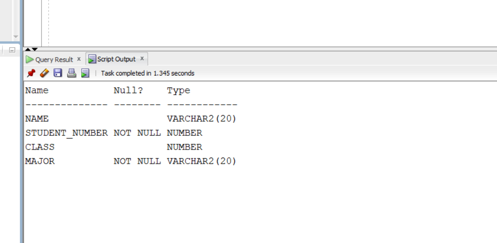
# Copy Major attribute values into Branch attribute
...
ALTER TABLE Student
ADD Branch VARCHAR2(20);
UPDATE Student
SET Branch = Major;
SELECT Major, Branch FROM Student;
...
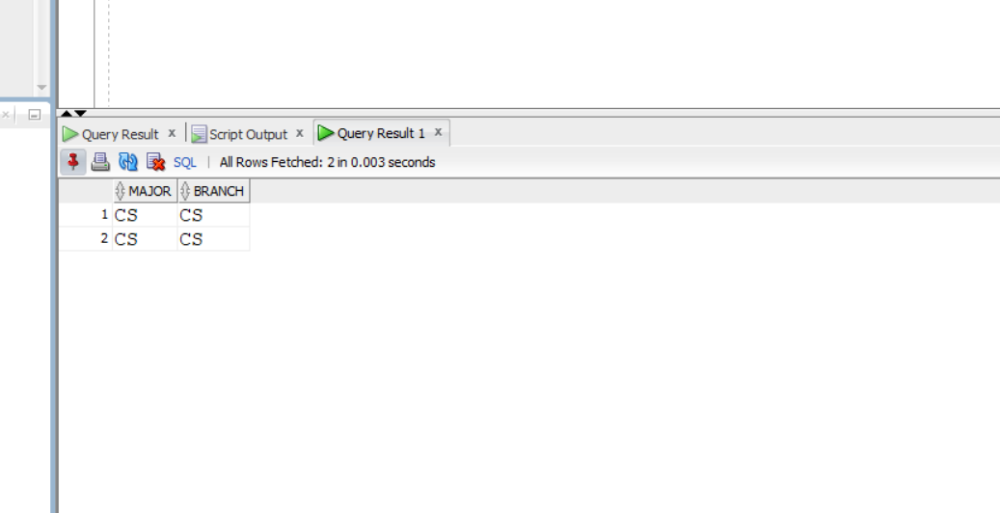
# Remove the Major attribute in Student
...
ALTER TABLE Student
DROP COLUMN Major;
DESC student;
...
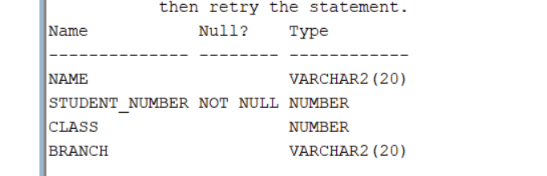
# Change Course_number to cid in Course
...
ALTER TABLE Course
RENAME COLUMN Course_number TO cid;
DESC Course;
...
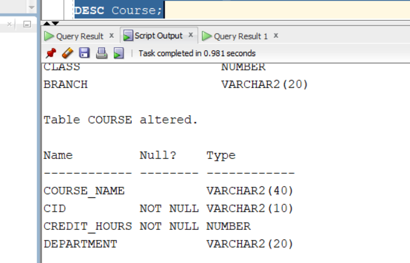
# Change the value of credit-hrs of Database to 4 in Course
...
UPDATE Course
SET Credit_hrs = 4
WHERE Course_name = 'Database';
SELECT * FROM Course;
...
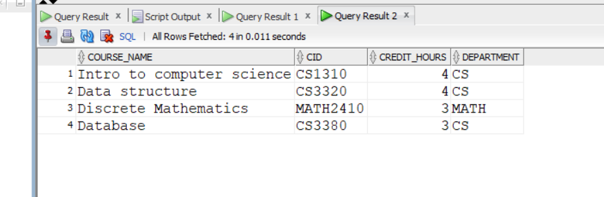
# Put NOT NULL constraint on Branch in Student
...
ALTER TABLE Student
MODIFY Branch VARCHAR2(20) NOT NULL;
...
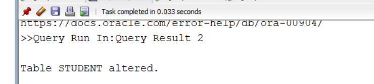
# Rename Student table to Pupil
...
RENAME Student TO Pupil;
...
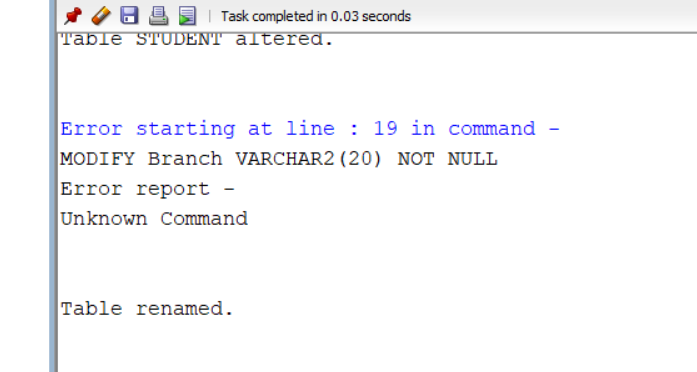
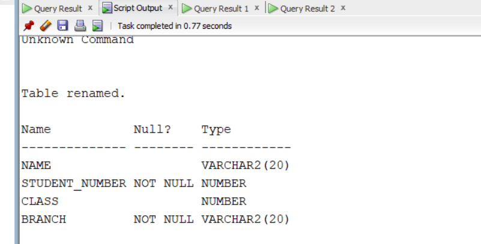
# Remove the Student table
...
DROP TABLE Pupil CASCADE CONSTRAINTS;
...
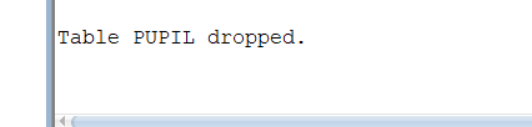
# Remove rows of 'Fall' semester in Section
...
DELETE FROM grade_report
WHERE section_identifier IN
(
    SELECT section_identifier
    FROM section
    WHERE semester = 'Fall'
);
DELETE FROM Section
WHERE Semester = 'Fall';
...
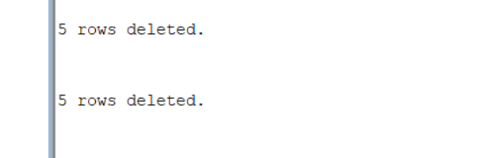
# Remove the row of 'Data_structure' in Course
...
DELETE FROM grade_report
WHERE section_identifier = 102;

DELETE FROM prerequisite
WHERE course_number = 'CS3320';

DELETE FROM section
WHERE course_number = 'CS3320';

DELETE FROM section
WHERE course_name = 'Data Structure';
...

# Remove all rows in all tables using TRUNCATE
...
TRUNCATE TABLE grade_report;
TRUNCATE TABLE prerequisite;
TRUNCATE TABLE section;
TRUNCATE TABLE course;
TRUNCATE TABLE pupil;
...
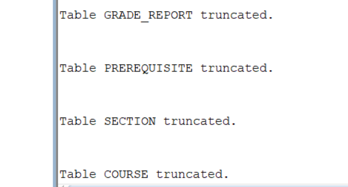
# Remove Pupil, Course and Section tables so that they exist in Recycle Bin
...
SELECT table_name
FROM user_tables;
...
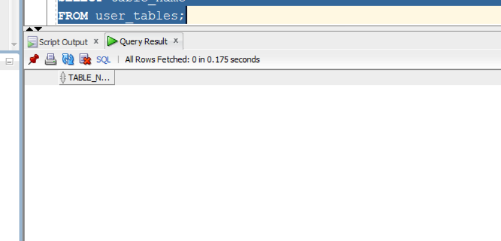

